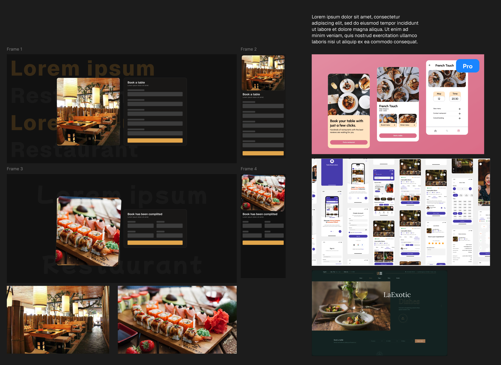

# Saveur Trainee Frontend Test

## Launch

```shell
# clone or download project from repository
git clone https://github.com/YXUNGGG/saveur-trainee-frontend-test.git

# npm | yarn | pnpm | etc.
pnpm i

# run project in dev mode
pnpm dev
```

## Decisions | Решения

- Для того, чтобы ускорить процесс разработки использовал `Tailwind` & `shadcn\ui` в качестве UI инструментов. Сделал мини макет в Figma (скриншот ниже)
- Не делил приложение на страницы, но можно было во избежание чрезмерной логики на клиенте (`client components`)
- Основную валидацию провожу в `server action` с помощью `zod`. С помощью передачи колбек функции пропсом меняю состояние бронированя в родителе



## Что бы сделал, если бы было больше времени

- Разработал более продуманный дизайн
- Подумал, как можно было бы частично избавиться от стейта и дать возможность инпутам самим обрабатывать себя + возвращать актуальное значение в `formData`. Это не так просто, так как почти на каждом инпуте непростые валидация и форматирование для красоты
- Уменьшил объем кода в конкретных файлах, разделил на компоненты, вынес утилитарные функции, типы и тп. в отдельные директории/файлы
- Улучшил мобильную версию (элементы больше, разметка продуманее)

### Additional links

#### Figma

https://www.figma.com/design/x6zgerZqAHBcqOQ6FewMQy/saveur-trainee-frontend-test?node-id=0-1&t=vrY6Nn6C4UyBrmi8-1

#### Deploy on Vercel

https://saveur-trainee-frontend-test.vercel.app
